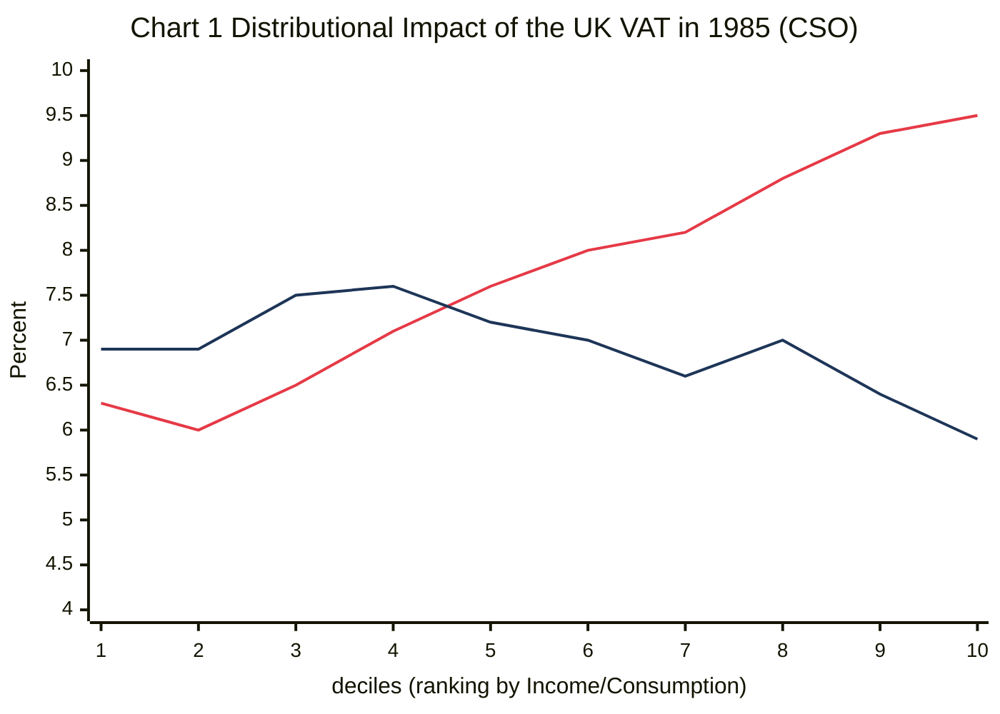

---
title: 经验：使用Obsidian写博客
---

# 1.格式

对笔者而言，用Markdown写作算是新鲜事，尽管有过使用Notion的经验，但并未切实使用过Markdown的代码格式，亦未切实学习过HTML格式，这是笔者的一大难题。

# 2.如何用mermaid画图

```mermaid
%%{init: { "themeVariables": { "xyChart": {"plotColorPalette": "#E63946, #1D3557"} } } }%%
xychart-beta 
title "Chart 1 Distributional Impact of the UK VAT in 1985 (CSO)" 
x-axis "deciles (ranking by Income/Consumption)" [1, 2, 3, 4, 5, 6, 7, 8, 9, 10] 
y-axis "Percent" 4 --> 10 
line "VAT/Consumption" [6.3, 6.0, 6.5, 7.1, 7.6, 8.0, 8.2, 8.8, 9.3, 9.5] 
line "VAT/Gross Income" [6.9, 6.9, 7.5, 7.6, 7.2, 7.0, 6.6, 7.0, 6.4, 5.9]
```