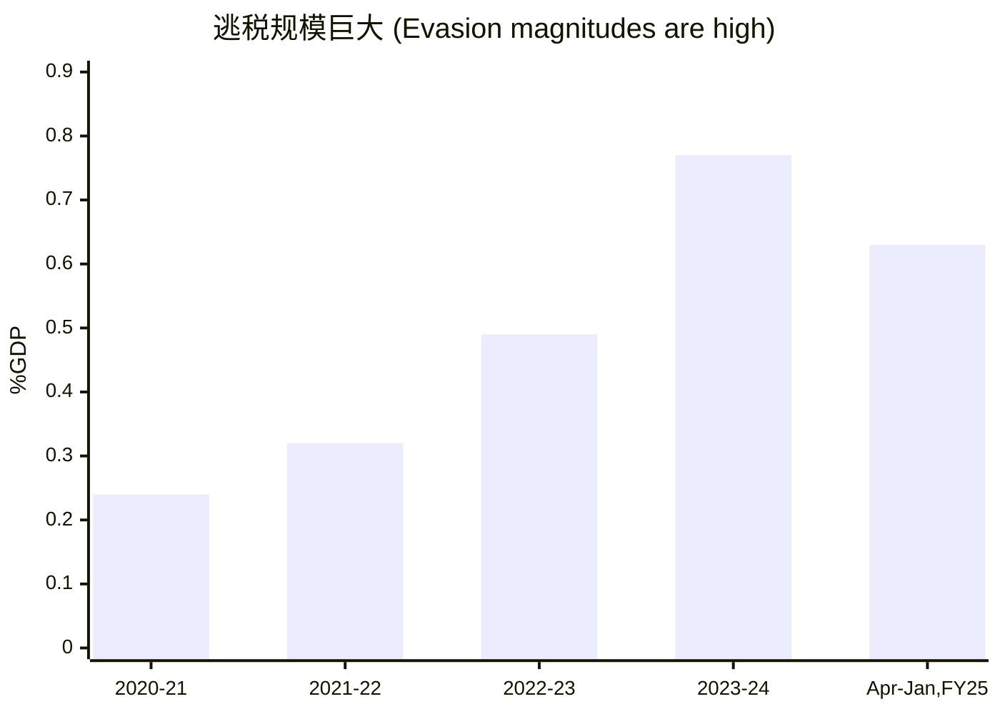

>[!NOTE] Translated with Gemini 3.1 pro
>**作者： Renu Kohli 来源： Worldbank. 
---

# GST 改革：概况

综合间接税： 2017 年 7 月起在全印度实施的货物和服务综合间接税，带有进项税额抵免（Input Tax Credit）。这是一种全国范围内的、基于目的地征收的最终消费税，旨在取代以往国内消费税的级联结构（即多重征税）。

 漫长的历程： 从构思到最终落地经历了 1992/93 年至 2017 年。期间包括中央与各邦就方案设计达成一致、通过宪法修正案以整合税基、2016 年成立 GST 委员会并最终启动。
  
最终设计： 共有 5 种税率（0%, 5%, 12%, 18%, 28%）。系统完全线上化，采用增值税（VAT）模式和发票匹配机制。

排除项： 石油产品、电力和房地产未纳入 GST 基础范围。因此，过去税制中显著的级联效应（重复征税）在这些领域依然存在。

收入风险补偿： 中央政府承担收入风险。法律保障各邦的 GST 收入——以 2015-16 财年为基准，承诺每年增长 14%，以补偿收入受损的邦。资金来源：对“罪恶商品”（如烟酒）或奢侈品征收为期 5 年的非退税补偿附加费。

---

印度：GST 纳入与排除项清单

|                |                                                                                                                                                        |                                                                                                                                                                                                                                  |
| -------------- | ------------------------------------------------------------------------------------------------------------------------------------------------------ | -------------------------------------------------------------------------------------------------------------------------------------------------------------------------------------------------------------------------------- |
| 类别             | 中央 (Centre)                                                                                                                                            | 各邦 (States)                                                                                                                                                                                                                      |
| 已纳入 (Included) | 中央消费税 (Central Excise Duty)  附加消费税 (Additional Excise Duties)  附加及特别附加关税  服务税 (Service Tax)  各类附加税及附加费 (Cesses and surcharges) | 邦增值税/销售税 (State VAT/Sales Tax)  中央销售税 (Central Sales Tax)  购买税 (Purchase Tax)  各类入市税和进入税 (Octroi and Entry Tax)  奢侈税（地方机构征收）  娱乐税 (Entertainment Tax)  彩票、投注、赌博税  广告税  邦级附加税及附加费 |
| 已排除 (Excluded) | 石油及烟草制品的消费税                                                                                                                                            | 石油产品的中央销售税 (CST)  食用酒精的邦消费税和增值税  娱乐税（由地方机构征收部分）  电力销售税  车辆税                                                                                                                                              |

备注： 自 2015-16 年起，许多附加税和附加费已逐步取消。
- 现有的宪法修正案未涉及房地产，若要将其纳入 GST 范围，需要另行修订宪法。

---

# 彼时的预期目标
核心改革目标：通过提高经济效率来实现额外的**财政收入动员**（即增加国家税收）。

效率提升：排除 GST 后的最终产品价格将等同于生产的“真实”投入成本，从而实现更优的资源配置。

- 贸易无障碍： 促进不受限制的跨邦贸易，降低物流成本、缩短运输时间并减轻行政负担。
	
- 量化预测：（根据 Chadha 等人的研究，以 2008-09 年为基准，预计 GDP 将增长 0.9-1.7%，出口增长 3.2-6.3%）。

收入增长：通过协调激励机制来鼓励税务合规，扩大税基，并推动经济的正规化。
- 虽然设定的 GST 税率在理论上是“收入中性”（Revenue-neutral）的，但预期会带来更高的**税收弹性**（即税收增长速度快于经济增长速度）。
- > 首席经济顾问 (CEA) Subramanian (2018) 的观点： “我们的保守估计是，一旦系统稳定下来，GST 应该能额外为我们贡献 GDP 的 1% 到 1.5%的收入……我们也预期印度国内贸易将大幅增加，这在某种意义上就像是削减了关税……这同样会促进贸易和经济增长。”

历史经验： 借鉴先前省级增值税（VAT）的经验——其收入影响在 5 年的滞后期后显现。2015 财年的各邦总收入比 2005 财年（实施 VAT 前）高出了 **1 个百分点** (Rajaraman, 2019)。

# 七年之后：改革成果与收入表现

收入估算的波动性：由于最终审计账目通常滞后两年，且 GDP 数据会不断修订，因此在获得最终定论前，对 GST 收入表现的评估往往因所选用的数据源而异。

- **Mukherjee (2023) 关于 2018-2023 财年的研究：**
    
    - 名义达标：2023 财年，GST 总收入占 GDP 的比例达到了改革前的水平，即 **6.1%**。
        
    - 剔除因素： 如果扣除补偿附加费（补偿附加费年均约占 GDP 的 0.48%），实际 GST 收入占 GDP 的比例仅为 **5.7%**。这意味着在改革五年后，核心收入水平仍远低于改革前。
    
- **Agarwal 等人 (2024) 关于 2019-2024 财年的研究：**
    
    - 该研究采用了 2024 年 2 月发的实际退税数据进行分析。
        
    - 延迟达标：数据显示，收入表现直到一年后（即 2024 财年）才真正匹配上改革前占 GDP **6.1%** 的水平。

近期趋势：尽管经历了上述的回升，但最近的 GST 收入表现再次显现出令人失望的迹象。

# 改革七年后，收入仍落后于GST改革前
![[India's GST Reform Policy Persperctive 1.png]]
## **5.63% 对比 6.1%（占 GDP 比例）**

GDP 基准调整的影响：基于最新的 GDP 数据重新计算后发现，税收收入水平显得较为低迷。

剔除补偿金后更低： 如果扣除为了补偿各邦损失而征收的“补偿附加费”（Compensation Cess），实际的 GST 收入占比会比目前的数字还要低。

 多重影响因素：收入不及预期主要受以下因素影响：
 
1. **税率下调（2019 年）：** 政策性减税直接影响了总税收。
	
2. **2020 年后的短期偶发因素：**
        
    - **疫情冲击：** 供应链中断、复苏路径不均衡且非线性、需求结构发生转变、政府采取临时减免措施，以及商品价格震荡。
            
    - **线性关系被打破：** 价格和销量的非对称效应，干扰了税基与税收之间的传统线性关系。
            
3. **通货膨胀：** * 持续且普遍的高通胀导致了各行业间相对价格的剧烈波动和结构性位移。
        
    - **名义数据对比：** 名义 GDP 分别增长了 14% 和 12%，而 GST 收入分别增长了 22.2% 和 13.4%。
            
    - **税收弹性非中性：** 这种增长是不均衡的，会对整体税收收入的构成产生深远影响。

我们必须更久的时间来判断成效

# 哪些生效，哪些无效，哪些做错了？

正面成果：
- 协作典范：达成了共识与合作，建立了协商机制。但这既是它的优点，也是它的缺点（决策可能因妥协而低效）。
       
- 打破壁垒：消除了跨邦贸易壁垒，建立了强大的信息技术基础设施和 **电子运单 (e-way bills)** 系统。
      
设计缺陷：
    
- 结构复杂：税率结构多且复杂，标准税率偏高（**18%**，而亚洲平均水平为 10.9%，全球平均为 15.3%）。
    
- 覆盖不足：存在大量免税项目，且金融服务、房地产等领域尚未纳税，导致政策存在漏洞。
    
- 合规繁琐：合规机制极其复杂。
    
- 起步期与根本性问题：
    
- 技术故障：因难以理解结构复杂性而导致技术及其他层面的故障。
    
- 流程冗长：涉及多级报税与申报程序、订单/发票匹配、正向/逆向追踪、进项税额抵免退回等环节。

整体表现与后果：
    
- 收入不及预期：揭示并制造了严重的政策与合规漏洞。例如：**虚假进项税额抵免 (ITC) 申领**、退税结算延迟且极具挑战。
    
- 负面连锁反应：导致了“GST 厌恶”情绪，降低了合规性，甚至引发企业倒闭、瞒报营业额以及**大规模的逃税行为 (Substantial evasions)**。
    
- 政策反复：迫使政府不断调整税率、减税以及更改起征点（营业额阈值）。
    
- 核心反思：当初承诺的 **14% 名义收入增长**，是否是一个重大的决策失误？

# 意外的负面后果：中央附加税飙升与补偿期延长

![[India's GST Reform Policy Perspective 2.png]]

![[India's GST Reform Policy Perspective 3.png]]

- 收入表现不佳： 实际税收收入低于预期，且整体增长有所放缓。
    
- 政策与环境冲击： 2019 年实施了政策性减税，随后又遭遇了全球疫情的冲击。
    
- 补偿期限延长： 原本计划征收 5 年的补偿附加税 (Compensation Cess)（包括为偿还新冠期间贷款而收取的款项）已被延长至 2026 年 3 月。
    
- 负担分配不均： 收入不及预期导致了中央与地方在财政负担的分担上出现不平衡。
    
- 中央附加税激增： 为了抵消收入损失，联邦政府（中央）大幅调高了其他类型的附加税 (Cess)。
    
- 不利的实际影响： 
	- 累退性风险： 间接税本质上具有累退性（即对低收入人群的压力更大），额外的税负征收可能导致了过度征税。
	- 周期脱节： 这些额外的税收负担可能已经与实际的经济周期脱节（即经济不好时，税负反而可能加重）。

# 哪些地方本可以做得更好？关键教训

### 1. 时机选择 (Timing)

- 多重冲击： GST 的实施（2017 年 7 月）紧跟在 2016 年 11 月的“废钞令”（Demonetization）之后，且正值经济下行周期。
    
- 预警信号： 2017 年 5 月，印度中央统计局（CSO）下调了 2017 财年的 GDP 增长预期。
    
    - 2017 年 6 月，印度储备银行（RBI）指出：“新数据显示，工业和服务业的放缓早在 2016-17 财年第一季度就已开始，并在第四季度变得更加明显”。
        
### 2. 给各邦 14% 的收入增长保障 (14% Guarantee)

- 脱离现实的基准： 2013-2016 财年间，名义 GDP 的 5 年年均增长率仅为 12%，各邦生产总值（GSDP）平均增长率为 10.89% - 11.09%。
    
    - 要实现 14% 的收入保障，要求的税收弹性（Revenue-protection buoyancy）需达到 1.262 - 1.286 的高位。
        
- Gupta & Rajaraman (2020) 的实证研究：
    
    - 在 2012-2016 财年，各邦纳入 GST 的相关税收实际年均增长率仅为 7.59% - 7.67%，几乎只有补偿承诺值（14%）的一半。
        
    - 实际税收弹性（TB）平均仅为 0.685 - 0.704，远低于维持补偿所需的水平。
        
    - 当时只有 5 个邦的收入增长超过 14%，大多数邦处于 5% - 12% 之间。
        
### 3. 核心结论：缺乏透明度与先例

- 决策黑箱： 研究指出，“公共领域似乎从未讨论过 14% 的补偿率是如何得出的……也未见讨论过替代方案或备选税率”。
    
- 缺乏包容性： 如果当时能让所有利益相关者和领域专家参与进一个更透明、更包容的过程，本可以节省大量财政资金，并实现更公平的分配。
    
- 史无前例： “就我们所知，在任何其他联邦制国家，都没有过国家政府给出类似这种形式的收入保障承诺”。

## 结论

- 全面审查势在必行： 为了提高财政收入表现，必须进行广泛的审查。核心建议包括：采用单一且较低的税率、降低系统复杂性、解决退税难问题、提升行政效率，并为纳税人营造更积极的环境以稳定系统。
    
- 征收效率（C-efficiency）落后： 印度的 C-效率得分（衡量增值税征收效率的指标）低于同行——2023 财年为 0.42，低于全球平均水平 0.45（Modi, 2025）。因此，必须改进税务管理，并更有效地应用技术手段进行执法，以填补当前的政策和合规漏洞。
    
- 排除项的负面影响： 排除项同时损害了效率和合规性。例如：中央征收的石油产品消费税，以及各邦征收的销售税、车辆税、客货运税和电力税，估计占 2023 财年总间接税的 ~41%。
    
    - 削弱竞争力： 由于这些排除项在出口时并非“零税率”，运输环节产生的严重级联效应（重复征税）会渗透到经济的各个角落，削弱了印度的出口竞争力。
        
- 改革预期： 中央与各邦层面都已意识到上述问题。未来很可能会加大力度简化整体架构、扩大覆盖范围，并向单一税率迈进。
    
- 长期愿景： 从长远来看，一个更简单、更全面的 GST 体系无疑将显著提高生产力并增加公共财政收入。

注：C-efficiency是衡量VAT/GST表现的关键指标，计算的是实际税收收入占潜在税收总额（标准税率×最终消费总额）的比例。比例较低说明有大量的免税项目、多重低税率以及逃税行为。